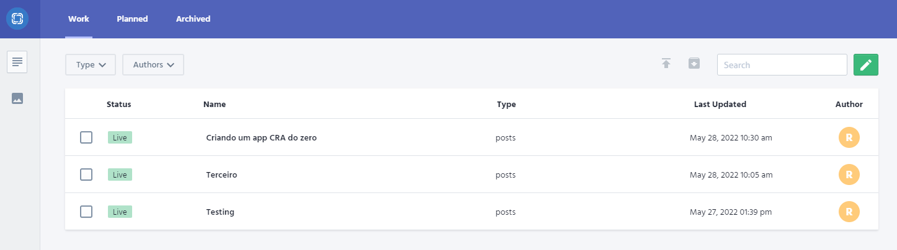
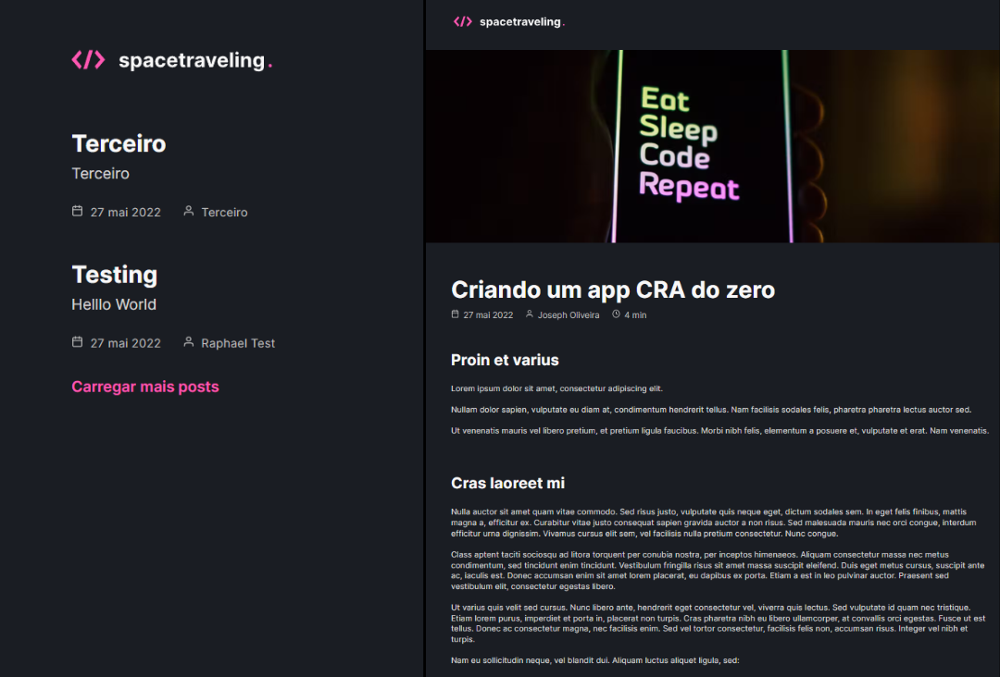

<h3 align="center">
  Challenge 05 - Creating an application from 0 with Next.js and Prismic CMS
</h3>

  

 

  

 

  

 

## 💻 About the challenge

In this challenge, I had to create an application from total 0, only with a Figma layout to guide me. The application is a blog that I had to connect with Prismic CMS. 🔥
This challenge was definitely a great one, I learned a lot building this application, Rocketseat never disappoints me.

 

## 🖱 Technologies

- ReactJS
- NextJS
- TypeScript
- PrismicCMS
- Css Modules
- Sass

 

 

## 📰 License

MIT. 